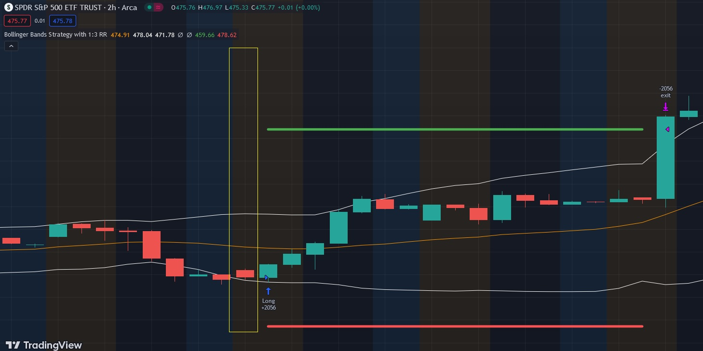

# Bollinger Bands

The Bollinger Bands is a technical indicator that consists of three lines: a simple moving average (SMA) in the middle and an upper and lower band that are two standard deviations away from the SMA. The Bollinger Bands can be used to identify overbought and oversold conditions in the market.

A strategy that consists of buying a stock when the price crosses over the lower band of the Bollinger Bands and selling a stock when the price crosses under the upper band can be effective in capturing short-term price movements. When the price crosses over the lower band, it may indicate that the stock is oversold and due for a rebound, while when the price crosses under the upper band, it may indicate that the stock is overbought and due for a correction.

To implement this strategy, traders would need to first identify stocks that have been trading within a range and are likely to experience a breakout. Once a stock is identified, traders would then wait for the price to cross over the lower band, which could be a potential entry signal. If the price moves in the desired direction, traders could then wait for the price to cross under the upper band, which could be a potential exit signal (or a shorting signal).

