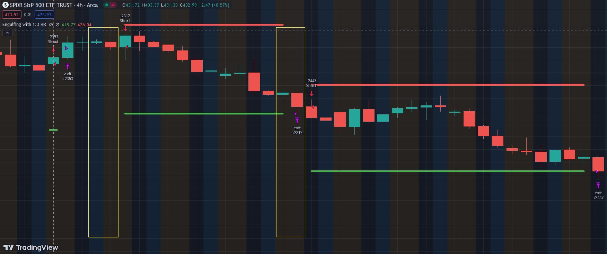

# Engulfing

The Engulfing pattern is a popular candlestick reversal pattern used by traders in technical analysis. It occurs when a small candle, often with a small body and shadows, is completely engulfed by the subsequent larger candle. There are two types of Engulfing patterns: Bullish Engulfing and Bearish Engulfing.

Bullish Engulfing:
    A Bullish Engulfing pattern forms at the end of a downtrend.
    The first candle has a small body, and the second candle is larger, completely covering the range of the first candle.
    This pattern indicates a shift in sentiment from bearish to bullish. The buyers have overwhelmed the sellers, leading to a potential reversal of the downtrend.

Bearish Engulfing:
    A Bearish Engulfing pattern occurs at the end of an uptrend.
    The first candle has a small body, and the second candle is larger, completely engulfing the first candle's range.
    The Bearish Engulfing suggests a reversal in sentiment from bullish to bearish. Sellers have taken control, indicating a potential downtrend reversal.

