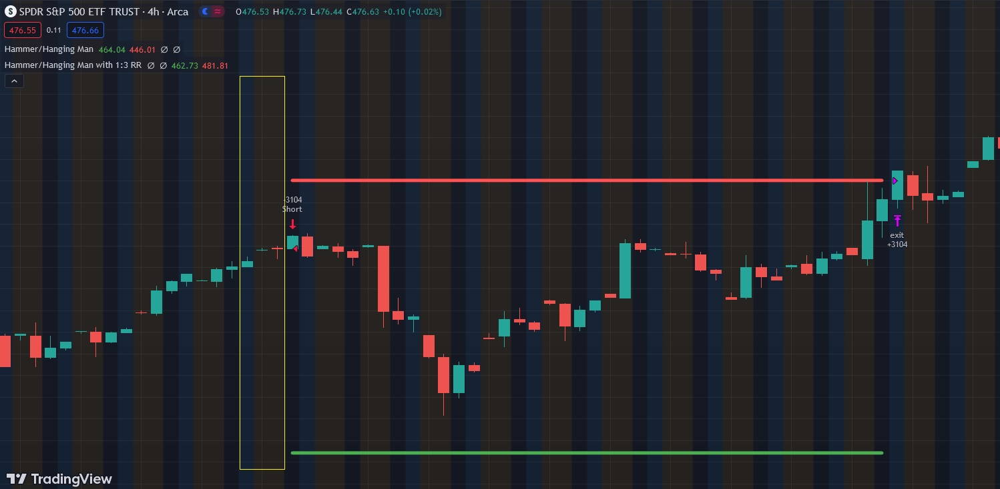

# Hammer and Hanging Man

Hammer:
The Hammer is a bullish reversal candlestick pattern that typically forms at the end of a downtrend. It consists of a small body near the high of the candle and a long lower shadow that is at least two times the length of the body. The presence of a Hammer suggests that sellers drove prices lower during the session, but strong buying pressure emerged by the close, causing the price to bounce back up. Traders often interpret a Hammer as a sign that the market sentiment may be shifting from bearish to bullish.

Hanging Man:
The Hanging Man is a bearish reversal candlestick pattern observed at the end of an uptrend. It shares similarities with the Hammer but appears in an upward market. It has a small body near the low of the candle and a long lower shadow that is at least two times the length of the body. The Hanging Man indicates that buyers pushed prices higher initially, but sellers took control by the close, signaling a potential reversal. Traders view the Hanging Man as a warning that the upward trend might be losing momentum.

