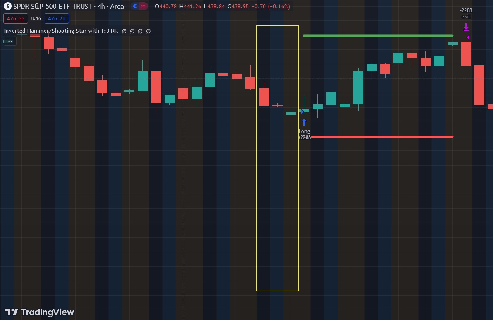

# Inverted Hammer and Shooting Star

Inverted Hammer:
The Inverted Hammer is a bullish reversal candlestick pattern commonly used in technical analysis. It forms at the end of a downtrend and consists of a small body with a long upper shadow and little to no lower shadow. The small body indicates that the opening and closing prices were close together, while the long upper shadow suggests that buyers pushed the price significantly higher during the session. The Inverted Hammer implies a potential trend reversal from bearish to bullish, with buyers gaining strength and overcoming selling pressure.

Shooting Star:
The Shooting Star is a bearish reversal candlestick pattern that appears at the end of an uptrend. It has a small body with a long upper shadow and little to no lower shadow. The small body indicates that the opening and closing prices were near each other, while the long upper shadow suggests that sellers took control and pushed the price lower before the close. The Shooting Star pattern implies a potential reversal from bullish to bearish, signaling that sellers are gaining strength, and the upward momentum may be weakening.

