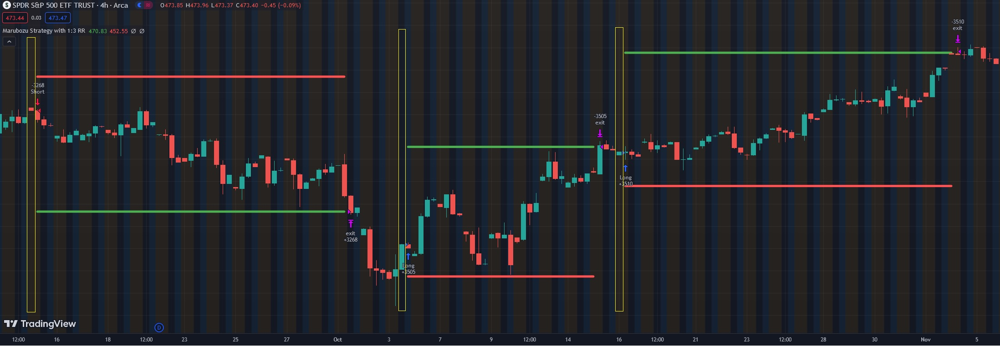

# Marubozu

The Marubozu is a candlestick pattern commonly used in technical analysis by traders to interpret market sentiment and potential trend reversals. This pattern consists of a single candle with a very long body and little to no wicks or shadows. The length of the body indicates strong buying or selling pressure.

There are two types of Marubozu: the bullish Marubozu and the bearish Marubozu.

Bullish Marubozu:
    A bullish Marubozu forms when the opening price is the same as the low, and the closing price is the same as the high.
    This pattern suggests that buyers were in control throughout the entire trading session, pushing the price higher without significant retracement.
    Traders often interpret a bullish Marubozu as a signal of strong buying interest and potential continuation of an upward trend.

Bearish Marubozu:
    A bearish Marubozu forms when the opening price is the same as the high, and the closing price is the same as the low.
    This pattern indicates that sellers dominated the market throughout the session, driving the price lower without significant retracement.
    Traders view a bearish Marubozu as a signal of strong selling pressure and a potential continuation of a downward trend.

