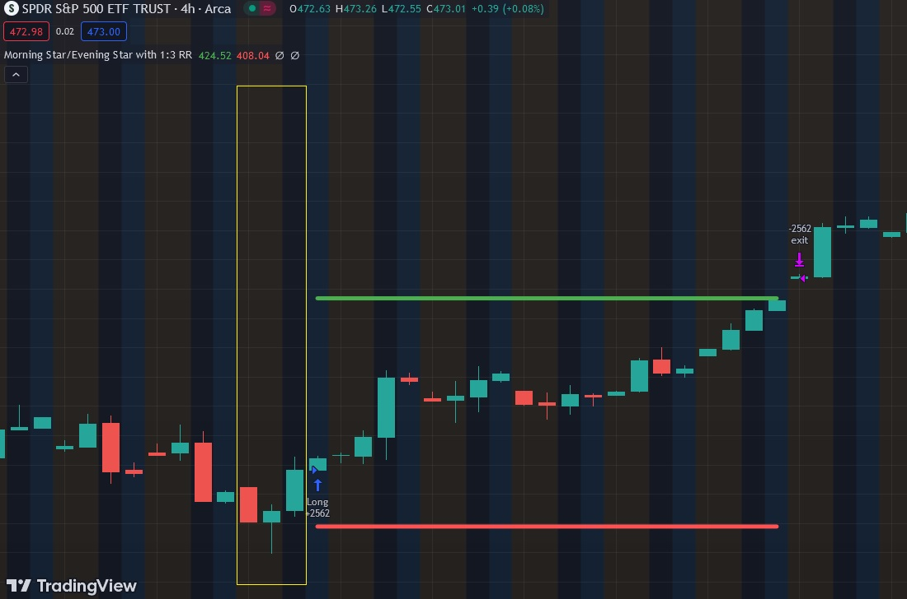

# Morning Star and Evening Star

Morning Star:
The Morning Star is a bullish reversal candlestick pattern that typically occurs at the end of a downtrend. It consists of three candles. The first candle is a large bearish candle, indicating strong selling pressure. The second candle is a small-bodied candle, preferably a doji or spinning top, signaling indecision. The third candle is a large bullish candle, closing well into the body of the first candle. The Morning Star pattern suggests a shift in market sentiment from bearish to bullish, with the potential for an upcoming uptrend. Traders often see the Morning Star as a signal to go long or exit short positions.

Evening Star:
The Evening Star is the bearish counterpart to the Morning Star and occurs at the end of an uptrend. Like the Morning Star, it consists of three candles. The first candle is a large bullish candle, representing strong buying pressure. The second candle is a small-bodied candle indicating indecision. The third candle is a large bearish candle that closes well into the body of the first candle. The Evening Star signals a potential reversal from bullish to bearish, and traders may interpret it as a signal to go short or exit long positions.

