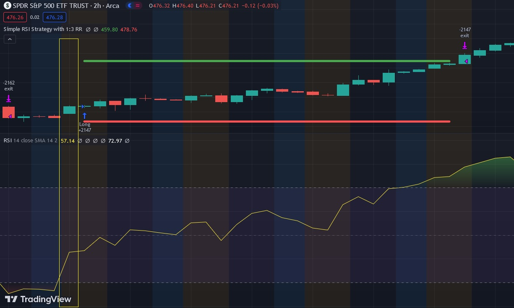

# Relative Strengh Index (RSI)

The Relative Strength Index (RSI) is a popular technical indicator that measures the magnitude of recent price changes to evaluate overbought or oversold conditions of an asset. A strategy that consists of buying a stock when the price crosses over the RSI value of 30 and selling a stock when the price crosses under the RSI value of 70 can be an effective way to identify potential entry and exit points.

When the RSI falls below 30, it suggests that the asset is oversold, which may indicate a buying opportunity. Conversely, when the RSI rises above 70, it suggests that the asset is overbought, which may indicate a selling opportunity.

To implement this strategy, traders would need to first identify stocks that have a tendency to experience oversold or overbought conditions. Once a stock is identified, traders would then wait for the RSI to cross above 30, which could be a potential entry signal. A stop-loss order could be placed just below the recent low to limit potential losses. If the price moves in the desired direction, traders could then wait for the RSI to cross under 70, which could be a potential exit signal. A take-profit order could be placed just above the recent high to lock in potential gains.

