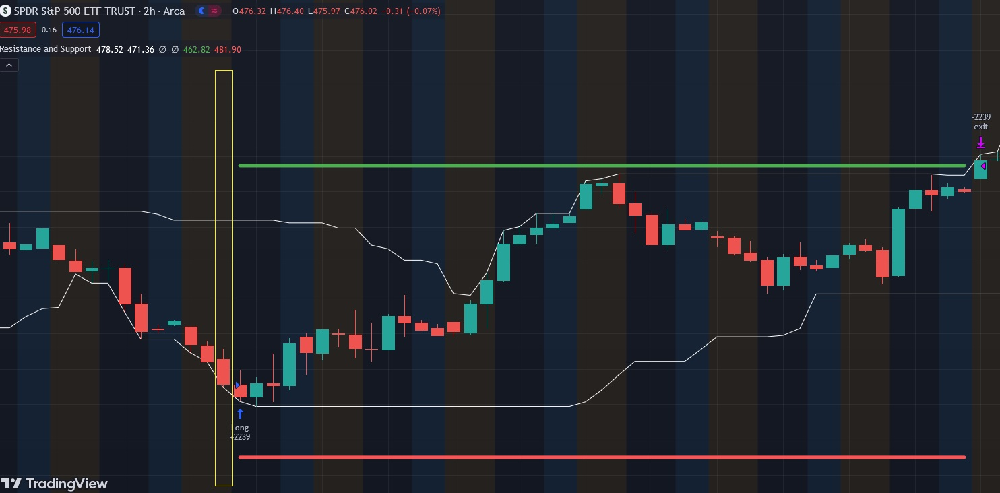

# Support and Resistance

The "Support and Resistance" strategy refers to specific price levels on a chart where the price of an asset has historically had a difficult time moving above (resistance) or below (support).

Support is considered a price level at which a stock has historically stopped falling and may even bounce back upwards. Traders often see support as a potential buying opportunity.

On the other hand, resistance is a price level that a financial instrument has historically struggled to surpass. Traders view resistance as a potential selling point, anticipating that the price might reverse or stall at that level.

Traders use support and resistance levels to identify potential entry and exit points for trades. When the price approaches a support level, they may consider buying, expecting a bounce back. Conversely, when the price nears a resistance level, traders might consider selling, anticipating a potential reversal.

