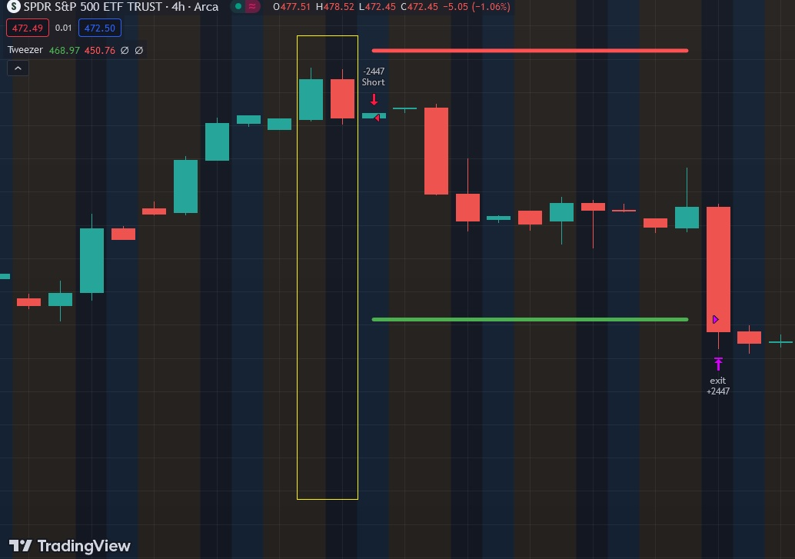

# Tweezer

The Tweezer Top and Bottom pattern is a candlestick pattern that traders use in technical analysis to identify potential trend reversals. It consists of two candles with matching highs (Tweezer Top) or lows (Tweezer Bottom), indicating a struggle between buyers and sellers.

Tweezer Top:
    A Tweezer Top occurs at the end of an uptrend and consists of two consecutive candles with similar highs.
    The first candle is bullish, indicating upward momentum, and the second candle is bearish, signaling a reversal.
    This pattern suggests that the buying pressure has weakened, and sellers may take control, potentially leading to a trend reversal to the downside.

Tweezer Bottom:
    A Tweezer Bottom forms at the end of a downtrend and consists of two consecutive candles with similar lows.
    The first candle is bearish, indicating downward pressure, and the second candle is bullish, signaling a potential reversal.
    The Tweezer Bottom implies that selling momentum has diminished, and buyers may be gaining control, suggesting a possible trend reversal to the upside.

