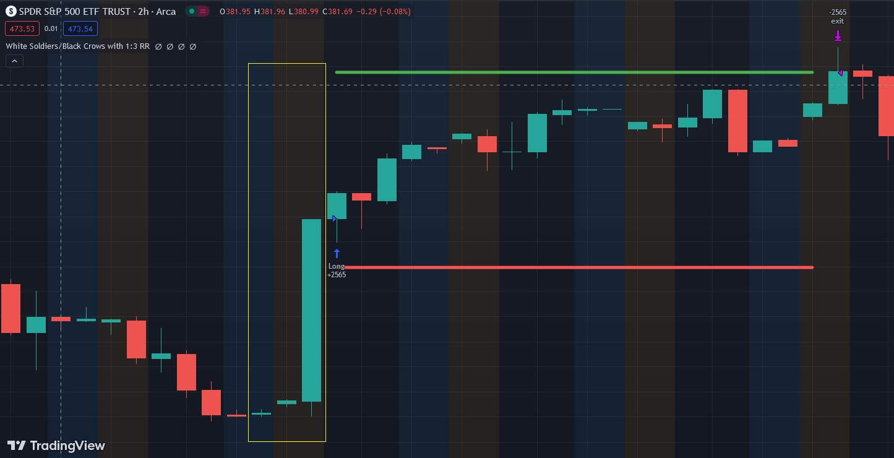

# White Soldiers and Black Crows

White Soldiers:
White Soldiers is a bullish candlestick pattern that consists of three consecutive white (or green) candles with progressively higher closes. Each candle opens within the previous candle's body and closes higher, creating a series of advancing bullish candles. The pattern suggests strong buying momentum and often occurs after a downtrend. Traders interpret White Soldiers as a signal that buyers have taken control, potentially leading to a sustained uptrend. This pattern is considered a bullish reversal or continuation signal, depending on the context.

Black Crows:
Black Crows is the bearish counterpart to White Soldiers and is a bearish candlestick pattern. It consists of three consecutive black (or red) candles with progressively lower closes. Similar to White Soldiers, each candle opens within the previous candle's body and closes lower, forming a series of declining bearish candles. Black Crows typically appear after an uptrend, signaling a potential reversal to the downside. Traders view Black Crows as an indication that sellers are gaining control, and the upward momentum may be weakening. This pattern can be seen as a bearish reversal or continuation signal, depending on the broader market context.

